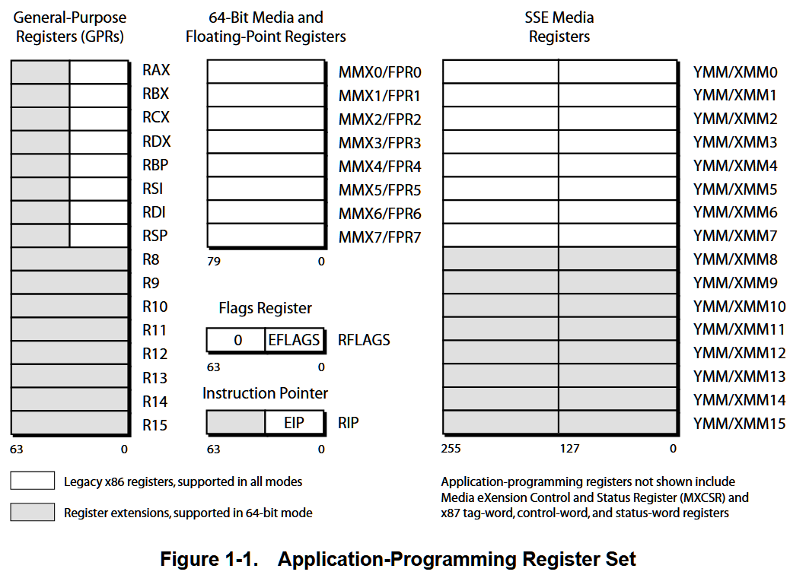
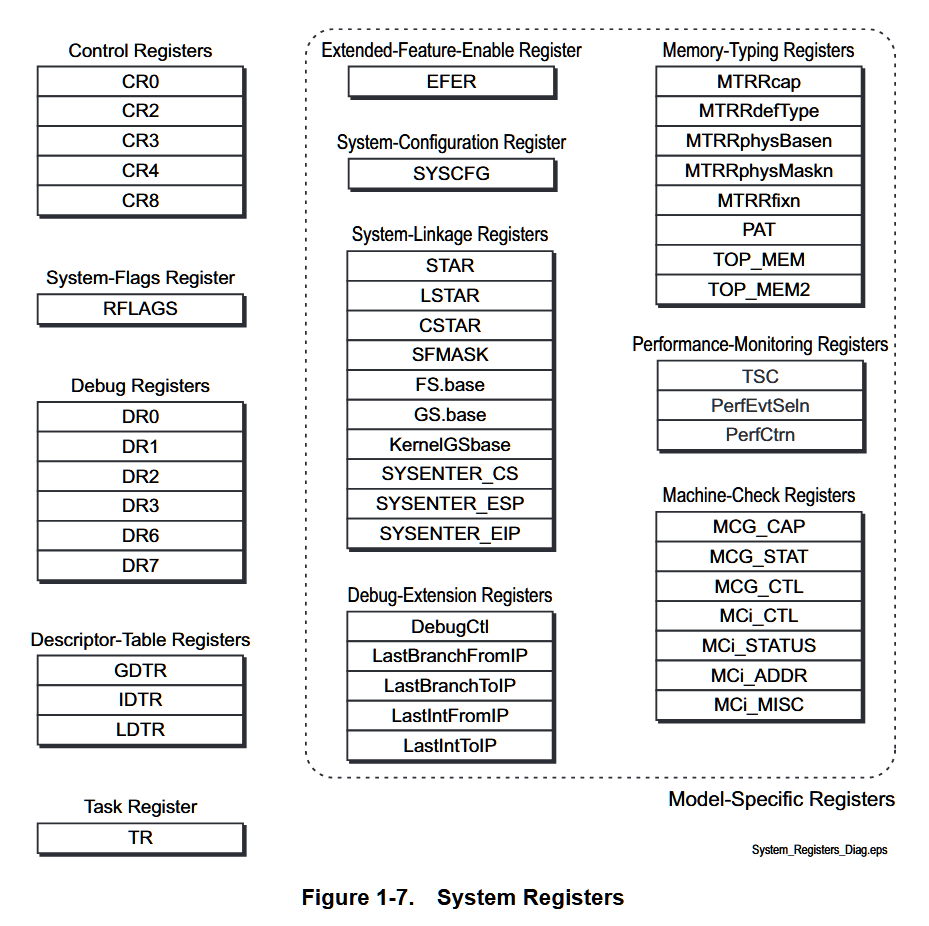
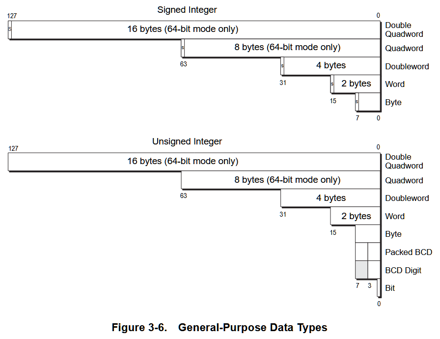
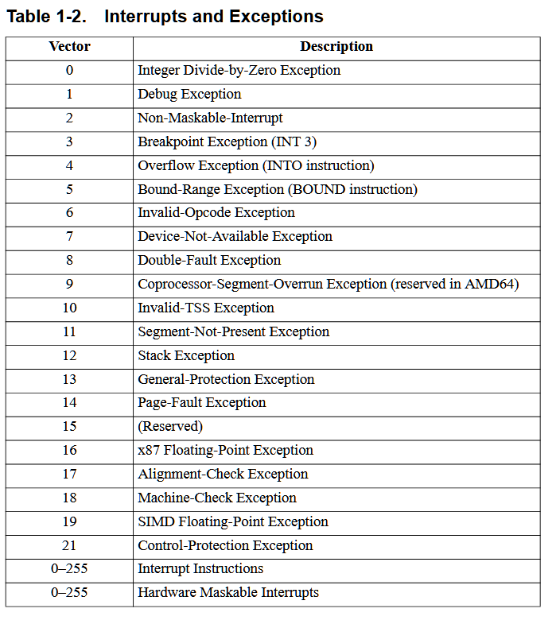

## Python Programming for Hackers and Reverse Engineers

Examples from book https://nostarch.com/ghpython.htm

by Justin Seitz

## Architecture

Updating original [book code](https://nostarch.com/download/ghpython_src.zip) to run on amd64 (Ryzen 9 5900X), Python 3.11.x on Windows 10 pro (22H2): 

[Ctypes reference](https://docs.python.org/3.11/library/ctypes.html)

[AMD64 Architecture Programmer's Manual](https://www.amd.com/content/dam/amd/en/documents/processor-tech-docs/programmer-references/40332.pdf)

[Win32 API](https://learn.microsoft.com/en-us/windows/win32/api/_base/)

### Registers

### System Registers

### Data Types

### Interrups

## WINAPI Links

#### processthreadsapi.h

* CreateProcessA
https://learn.microsoft.com/en-us/windows/win32/api/processthreadsapi/nf-processthreadsapi-createprocessa

* StartupInfoA
https://learn.microsoft.com/en-us/windows/win32/api/processthreadsapi/ns-processthreadsapi-startupinfoa

* ProecssInformation
https://learn.microsoft.com/en-us/windows/win32/api/processthreadsapi/ns-processthreadsapi-process_information

* OpenProcess
https://learn.microsoft.com/en-us/windows/win32/api/processthreadsapi/nf-processthreadsapi-openprocess

#### debugapi.h
* DebugActiveProcess
https://learn.microsoft.com/en-us/windows/win32/api/debugapi/nf-debugapi-debugactiveprocess
